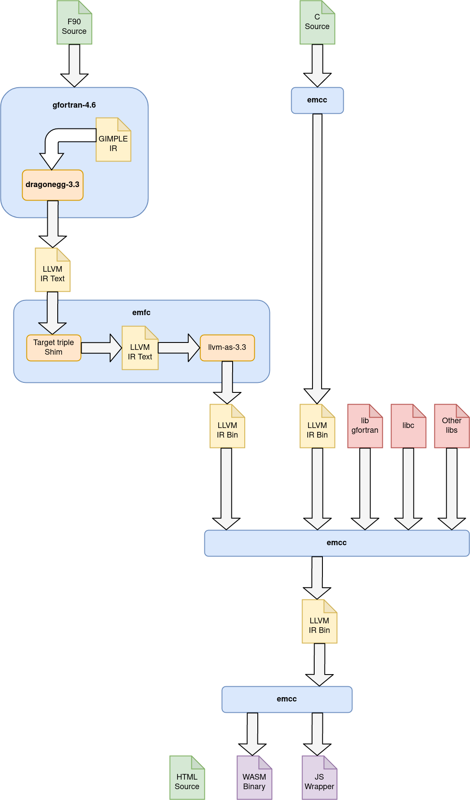

# Full-Stack-Fortran

A toolchain to compile Fortran to Webassembly, and a few projects using it.

Blog post: https://chrz.de/2020/04/21/fortran-in-the-browser/

Docker image: https://hub.docker.com/r/stargate01/f90wasm

## Usage

Run `./f90wasm/build.sh` to build the docker image locally. A pre-compiled image is available on the [Docker Hub](https://hub.docker.com/r/stargate01/f90wasm).

Run `./test/test.sh` to compile the test application, and host it on http://localhost:8080 . Use `./test/clean.sh` to remove compiled test binaries.

## Thanks to

 - http://www.netlib.org/lapack/
 - https://gcc.gnu.org/
 - https://llvm.org/
 - https://emscripten.org/
 - https://github.com/smikes/femscripten

 ## TLDR

 